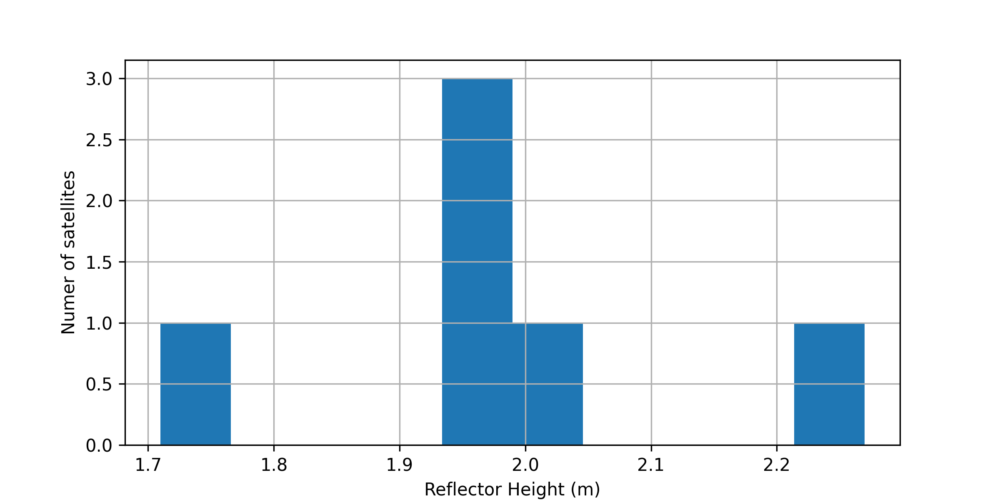
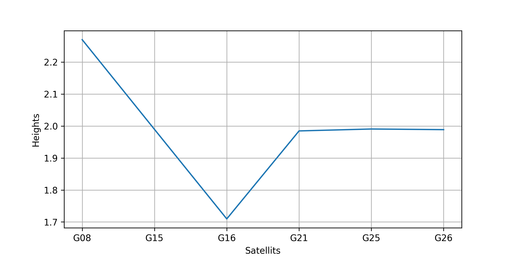

# 🚀 GNSS‑IR Reflector Height Estimation

## 📌 Overview
This project implements a full GNSS‑IR (Global Navigation Satellite System – Interferometric Reflectometry) pipeline to estimate the reflector height using GPS SNR data.

GNSS‑IR utilizes multipath interference in satellite signals to measure environmental properties such as surface height.

---

## 🎯 Objective
The main goal of this project is:

✅ Estimate reflector height using GNSS SNR signals  
✅ Apply signal processing techniques (detrending + FFT)  
✅ Perform multi-satellite analysis for high accuracy  

---

## 🛰️ Data Used
- RINEX Observation File (`.24o`)
- Precise Orbit Data (SP3)
- GNSS constellation: GPS (L1)

---

## ⚙️ Methodology

The pipeline consists of the following steps:

### 1️⃣ Geometry & Positioning
- Convert receiver position (ECEF → Geodetic)
- Compute ENU coordinates
- Calculate satellite elevation angle

---

### 2️⃣ Satellite Selection
- Use only satellites within:
 5° < elevation < 25°
- Ensure high quality:
points > 1000

---

### 3️⃣ Signal Processing
- Extract SNR data
- Remove invalid values
- Apply detrending (polynomial fitting)

---

### 4️⃣ GNSS‑IR Transformation
- Convert elevation to:

sin(elevation)
- Sort data for uniform sampling

---

### 5️⃣ Frequency Analysis (FFT)
- Apply Fast Fourier Transform
- Identify dominant frequency peak

---

### 6️⃣ Height Estimation
Using:
h = (λ × f_peak) / 2
Where:
- λ = 0.19029367 m (GPS L1 wavelength)

---

### 7️⃣ Multi-Satellite Analysis
- Compute height for each satellite
- Remove outliers
- Compute average and standard deviation

---

## 📊 Results

✅ **Average Reflector Height:** 1.99 m  
✅ **Standard Deviation:** 0.16 m  

✔ The results show high stability and consistency.

---

## 📈 Visualization

## 📊 Histogram

## 📈 Satellite Plot

---

## 🔍 Analysis

- Most satellites estimate height ≈ 2 meters  
- Very small variation between satellites  
- No significant outliers detected  
- Strong and clear FFT peaks  

---

## ✅ Conclusion

✔ Successful implementation of a full GNSS‑IR pipeline  
✔ Reliable and stable reflector height estimation  
✔ High-quality multi-satellite consistency  

---

## 🚀 Future Work
- Add GLONASS / Galileo processing  
- Implement weighted averaging  
- Extend to applications:
  - Soil moisture monitoring  
  - Snow depth estimation  
  - Water level tracking  

---

## 👨‍💻 Author
**Mohamed Khaled Elsayed Ahmed Matbouly**  
GNSS & Signal Processing Enthusiast 🚀
